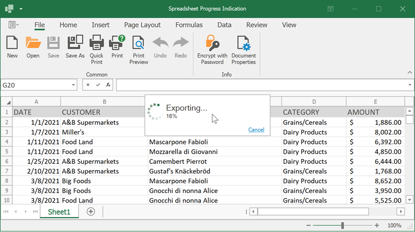

<!-- default file list -->
*Files to look at*:

* [Form1.cs](./CS/SpreadsheetProgressSample/Form1.cs) (VB: [Form1.vb](./VB/SpreadsheetProgressSample/Form1.vb))

* [WaitForm1.cs](./CS/SpreadsheetProgressSample/WaitForm1.cs) (VB: [WaitForm1.vb](./VB/SpreadsheetProgressSample/WaitForm1.vb))

<!-- default file list end -->

# WinForms Spreadsheet - How to Create a Custom Progress Indicator

This example demonstrates how to use a [DevExpress Wait Form](https://docs.devexpress.com/WindowsForms/10824/controls-and-libraries/forms-and-user-controls/splash-screen-manager/wait-form) to indicate the progress of lengthy operations (file load/save operations and export to PDF/HTML).

Use an [IProgressIndicationService](https://docs.devexpress.com/CoreLibraries/DevExpress.Services.IProgressIndicationService) service to create a custom progress indicator. Create a class that implements this interface and pass a class instance to the [SpreadsheetControl.ReplaceService](https://docs.devexpress.com/WindowsForms/DevExpress.XtraSpreadsheet.SpreadsheetControl.ReplaceService--1(--0)) method to replace the default progress indication service with your own service.
